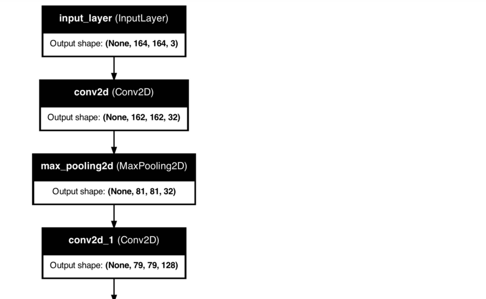
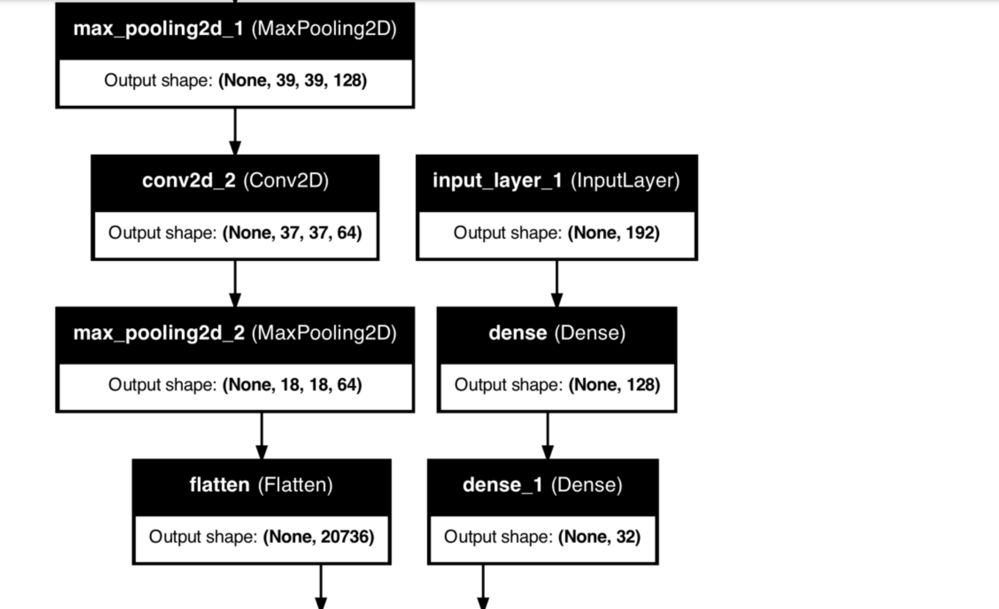
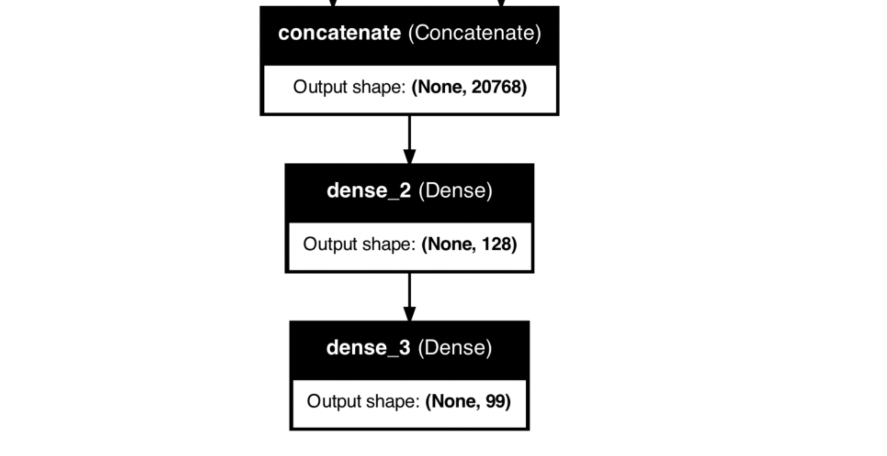

# Image Classification for 99 Plant Species

This repository showcases an **image classification project** designed to identify **99 distinct plant species**. What sets this project apart is the dual approach of leveraging **pre-extracted features** (shape, margin, and texture) along with **raw image data** to build a robust classification pipeline. The dataset comes from a Kaggle playground competition where the goal is to accurately recognize plant species based on **binary leaf images**.

---

## Table of Contents
1. [Project Description](#project-description)  
2. [Data Overview](#data-overview)  
3. [Data Preprocessing & Feature Extraction](#data-preprocessing--feature-extraction)  
4. [Model Architecture](#model-architecture)  
5. [Usage](#usage)  
6. [Future Enhancements](#future-enhancements)

---

## Project Description
The **core objective** is to predict one of **99 plant species** from leaf images. Leaves provide an effective means for differentiation due to their **unique shape, margin, and texture**. In addition to the raw images, a separate dataset of **extracted features** is also provided, enabling a **hybrid approach** to classification:

1. **Classifier with Pre-Extracted Features**: Leverage the existing shape, margin, and texture features to jump-start your model.  
2. **Custom Feature Creation**: Extend the feature set by extracting additional features from the raw images.  
3. **Error Analysis**: Identify misclassifications to refine the feature engineering and improve the model.

---

## Data Overview
- **Images**: Grayscale or binary leaf images, each labeled with a unique `id` and associated with a species name.  
- **Features DataFrame**: Numerical values capturing shape, margin, and texture, plus additional columns like `id` and `species`.  
- **Classes**: There are **99 unique species** in the dataset, each represented by multiple leaf samples.

**Dataset Size**:  
- ~14,000+ images (depending on the exact split).  
- **Features** DataFrame with **99 classes** and **numerous** pre-extracted feature columns.

---

## Data Preprocessing & Feature Extraction
A series of steps were taken to ensure the data was consistent, scaled appropriately, and ready for model training:

1. **Image Paths Construction**  
   - Mapped each `id` to its corresponding image file (e.g., `id.jpg`), storing the paths in the DataFrame for easy access.

2. **Image Loading & Resizing**  
   - Loaded images in **OpenCV** format and resized them to a **164×164** resolution.  
   - Normalized pixel values by dividing by 255.0.

3. **Feature Extraction**  
   - **Numeric Features**: Used the provided shape, margin, and texture data.  
   - **Target Label**: Extracted `species` from the DataFrame and applied **label encoding** to convert species names into integer labels.

4. **Combined Approach**  
   - Model inputs can include **both** the image array and the numeric feature set.  
   - The final model can be trained using **just images**, **just numeric features**, or a **concatenation** of both.

---

## Model Architecture
A **custom functional API** model was developed to handle the input data effectively. The model processes the **images** through a convolutional stack, while numeric features can be fed into a separate branch. Ultimately, the two branches can be concatenated before the final classification layer. The final output layer corresponds to **99 classes** using an appropriate activation (e.g., softmax).

**Sample Architecture** (screenshots):
1.   
2.   
3. 

---

